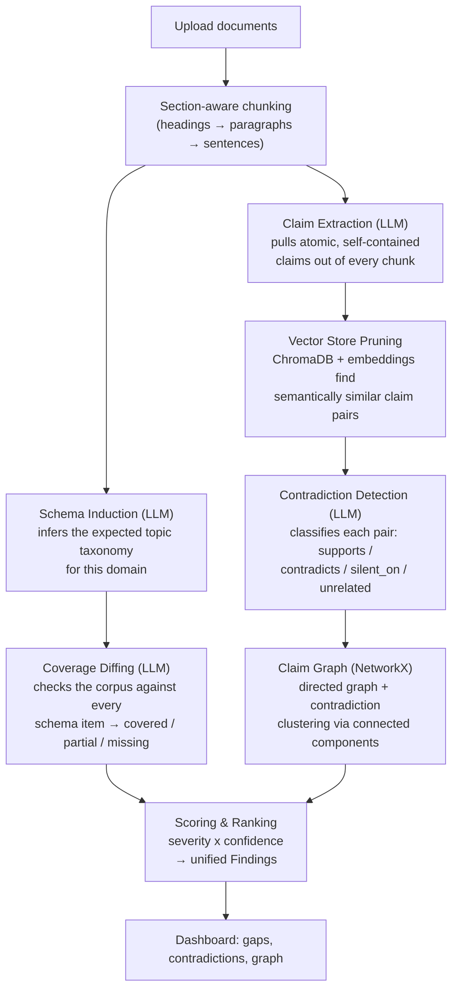

** Absentia**

**Absentia finds what your documents *don't* say.**

Absentia is an LLM-powered document-analysis platform that surfaces two things most tools ignore: **coverage gaps** (topics a document *should* address but doesn't) and **contradictions** (claims across a corpus that quietly disagree with each other). Point it at a README, a legal contract, a policy handbook, or a spec, and it reasons about the *negative space* — what's missing, what's stale, and what no longer agrees with itself.

> Built as an exploration of multi-stage LLM pipelines: schema induction, claim-graph reasoning, and confidence-scored findings — all provider-agnostic (Ollama / Anthropic / OpenAI).

---

## Why this exists

Most "AI doc analysis" tools summarize what's *there*. The harder, more valuable problem is reasoning about what's *not* there, and what stopped being true. Two concrete failure modes Absentia targets:

- **Coverage drift** — a project's docs cover installation and quick-start but silently never mention configuration, error handling, or versioning.
- **Policy drift** — a company publishes a 2023 data-retention policy and a 2025 revision, and nobody notices the two now contradict each other on retention windows.

The `sample_data/` folder ships with a real example of the second case: two versions of a data-retention policy where customer-data retention drops from 3 years to 1, transaction-log retention rises from 5 to 7, and access-log retention jumps from 90 days to a full year. Absentia's pipeline is built to catch exactly this kind of drift automatically, with a reasoning trace attached to every finding.

## How it works

Absentia runs uploaded documents through an eight-stage pipeline, orchestrated by `AnalysisOrchestrator`:



Every finding — gap or contradiction — carries a **confidence score**, a **severity**, and a **reasoning trace**, not just a verdict. That traceability was a deliberate design goal: a flagged contradiction is useless if you can't see *why* the model thinks two claims disagree.

## Core features

- **Provider-agnostic LLM layer** — a single `LLMProvider` interface (`chat` + `embed`) backs Ollama (local, free, default), Anthropic, and OpenAI. Swap providers with one environment variable; no pipeline code changes.
- **Cost-tiered model cascade** — pipeline stages are designed to map to `fast` / `mid` / `top` model tiers (e.g. cheap models for claim extraction, stronger models for schema induction), configurable per-stage via `.env`.
- **Section-aware chunking** — splits on markdown headings first, falls back to paragraphs, then sentences, so chunks stay semantically coherent instead of hard-truncating mid-thought.
- **Semantic candidate pruning** — instead of comparing every claim against every other claim (O(n²) LLM calls), a ChromaDB vector store pre-filters to only semantically similar pairs before the expensive contradiction check.
- **Claim graph with clustering** — contradictions are modeled as a directed graph (NetworkX), enabling connected-component analysis to find clusters of mutually contradicting claims, not just isolated pairs.
- **Multi-vertical schema library** — pluggable domain packs (`codebase_docs`, `legal_contracts`, `company_policy`, `engineering_specs`, `academic_research`), each with its own expected-topic schema and scoring rubric.
- **FastAPI + Jinja2 dashboard** — upload documents, trigger an analysis run, and browse ranked findings with an interactive `vis-network` graph of claim relationships.
- **SaaS-ready scaffolding** — `platform/` stubs out auth, RBAC (admin / schema_reviewer / contributor / viewer), billing/usage tracking, and multi-tenant org → workspace → project modeling, ready to wire up as the product grows past MVP.

## Tech stack

| Layer | Choice |
|---|---|
| API / server | FastAPI, Uvicorn, Jinja2 |
| Data models | Pydantic v2, pydantic-settings |
| LLM providers | Ollama (default), Anthropic, OpenAI |
| Vector store | ChromaDB (cosine similarity, Ollama embeddings) |
| Graph reasoning | NetworkX |
| Persistence | SQLAlchemy + Alembic, SQLite (MVP) → Postgres (planned) |
| Document parsing | python-docx, BeautifulSoup4, lxml |
| Frontend | Jinja2 templates, vis-network.js |
| Testing | pytest |

## Project layout

```
SuperApp/
├── main.py                      # FastAPI entrypoint
├── superapp/
│   ├── config.py                 # pydantic-settings: providers, cascade tiers, thresholds
│   ├── ingestion/                 # loader + section-aware chunker
│   ├── schema_induction/          # LLM-driven expected-topic schema generation
│   ├── coverage/                  # schema-vs-corpus diffing
│   ├── contradiction/             # claim extraction, pairwise detection, graph builder
│   ├── vectorstore/               # ChromaDB-backed similarity search
│   ├── scoring/                   # severity x confidence ranking → Findings
│   ├── engine/                    # AnalysisOrchestrator (pipeline glue)
│   ├── verticals/                 # domain registry (legal, policy, engineering, research, docs)
│   ├── schema_library/             # per-vertical schema definitions
│   ├── platform/                  # auth / RBAC / billing / tenancy scaffolding
│   ├── llm/                       # provider-agnostic LLM abstraction
│   ├── models/                    # Pydantic schemas shared across the pipeline
│   └── api/                       # REST routers + dashboard UI routes
├── dashboard/                    # Jinja2 templates + static assets
├── sample_data/                  # demo corpora, including a real policy-drift example
└── tests/                        # pytest suite
```

## Getting started

1. **Configure environment**
   ```bash
   cp .env.example .env
   ```
   By default, `LLM_PROVIDER=ollama` — no API key required, but you need a local [Ollama](https://ollama.com) instance running with `llama3.1` and `nomic-embed-text` pulled. To use Claude or GPT instead, set `LLM_PROVIDER=anthropic` or `openai` and add the matching API key.

2. **Install dependencies**
   ```bash
   pip install -r requirements.txt
   ```

3. **Run the app**
   ```bash
   python main.py
   ```

4. **Open the dashboard**
   Visit `http://localhost:8000/`, upload one or more documents (try `sample_data/policy_contradictions/`), and run an analysis.

## API reference

| Method | Endpoint | Purpose |
|---|---|---|
| `POST` | `/api/upload` | Upload documents, returns a `session_id` |
| `POST` | `/api/analyze` | Run the full pipeline against an uploaded session |
| `GET` | `/api/results/{analysis_id}` | Full analysis result (schema, claims, relations, findings) |
| `GET` | `/api/results/{analysis_id}/gaps` | Coverage-gap findings only |
| `GET` | `/api/results/{analysis_id}/contradictions` | Contradiction findings only |
| `GET` | `/api/graph/{analysis_id}` | Claim graph as nodes/edges, for visualization |

## Testing

```bash
pytest
```

The suite (`tests/test_core_architecture.py`) covers configuration loading, the core Pydantic models (including multi-tenancy and versioning types), the LLM provider interface, and vertical registry discovery.

## Roadmap

Absentia is an MVP with its production seams already cut, not yet welded:

- [ ] Wire the `platform/` auth, RBAC, billing, and tenancy stubs into the API layer
- [ ] Migrate persistence from SQLite to Postgres + pgvector (config flag already present)
- [ ] Fully route pipeline stages through the `fast` / `mid` / `top` model cascade defined in `.env.example`
- [ ] Parallelize claim extraction and contradiction checks (currently sequential per chunk/pair)
- [ ] Expand the schema library with richer, hand-curated per-vertical rubrics beyond the LLM-induced defaults

## License

MIT — see [LICENSE](LICENSE).
